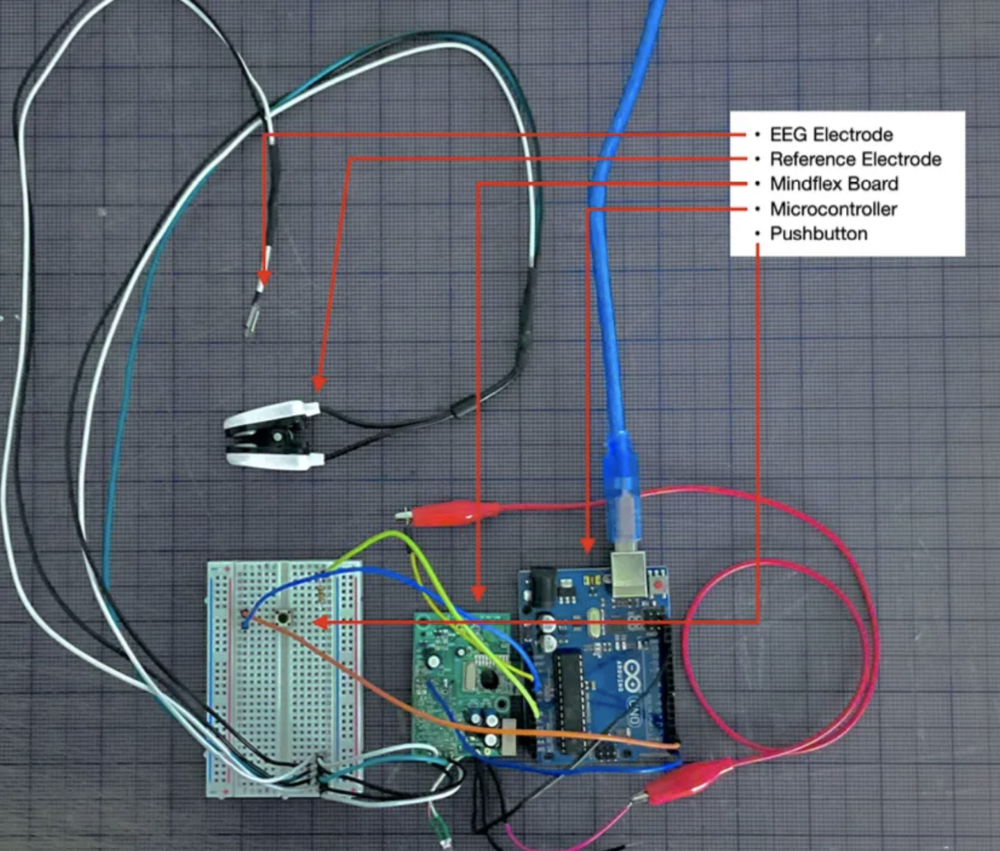
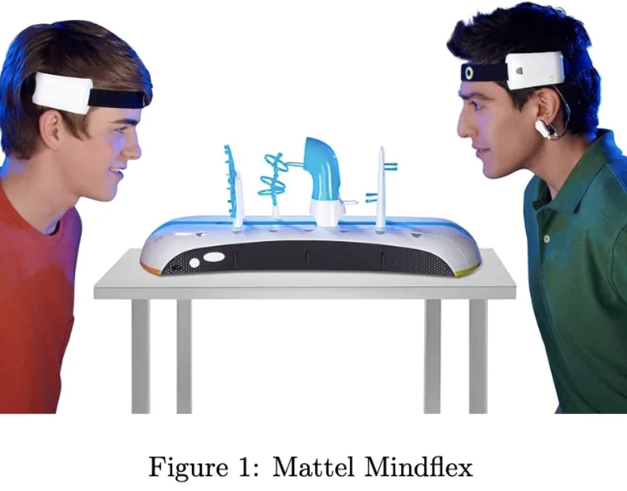
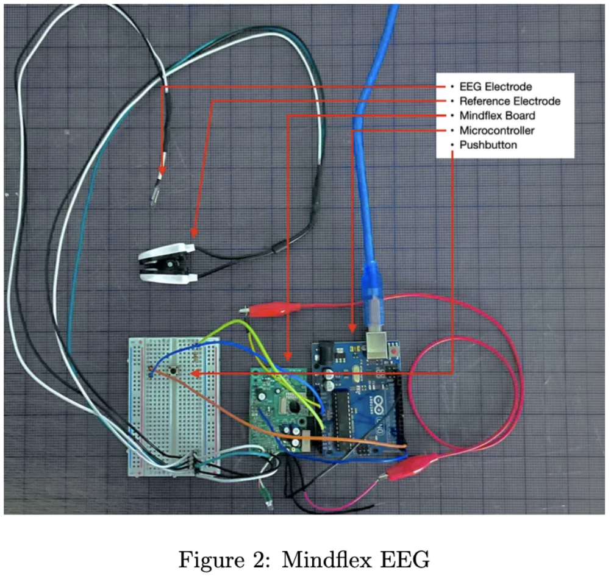
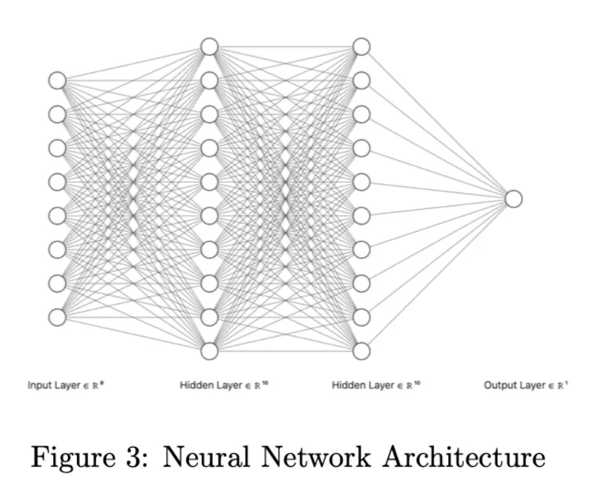
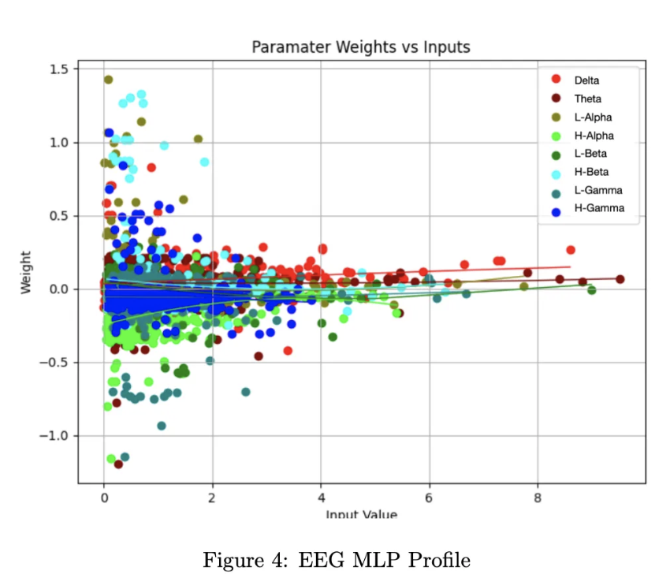
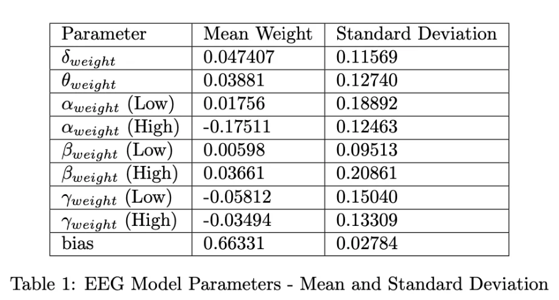
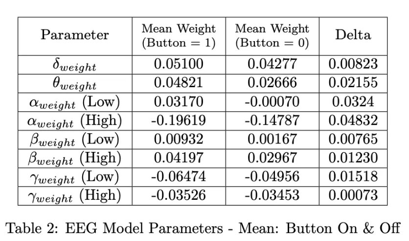
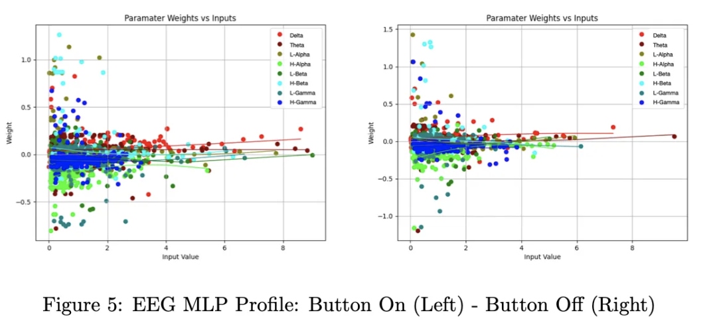
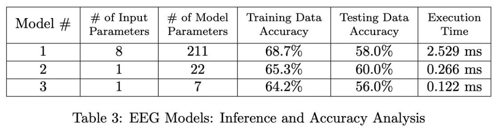

# Brainwaves on a Budget: 
**How I Trained Neural Networks with Brainwave Data from a Children’s Toy.**

- By: Geoff Lord
- Published: AUG 13 2024
- Link: https://geofflord.substack.com/p/brainwaves-on-a-budget

## Introduction:
In February of 2024, I began investigating ways in which I could interpret the learnings of multi-layer perceptron (MLP) neural networks. The objective was to generate training data from a simple equation, train a neural network to conform to that data, and rediscover the equation using the models parameters. After training over 100 models, considering many use cases, and losing some money on algorithmic crypto trading models I find myself here writing to you.

While initially investigating use cases of my interpretability engine the Neuralink software team released the Neuralink Compression Challenge. Futile attempts at devising a lossless compression algorithm amenable to the listed constraints greatly piqued my interest in Neuralink architecture as a whole. After these failures, I decided to investigate how my interpretability engine could improve model inference efficiency in a way that may make it possible to distinguish signal from noise on-head. This analysis required data not included in the Compression Challenge dataset, and understandably, my requests for additional data went unanswered, forcing me to get creative.

As a result of this constraint, I embarked on an engineering adventure that involved turning a children’s toy into an EEG, training neural networks on this toy’s extracted data, and a successful attempt at mapping less-than-ideal neural activity data to intended actions.

## An N1 Analog Device:
As I understand it, the N1 implant consists of 64 electrode threads, each with 16 electrodes providing data at 10b resolution with a sampling rate of 20kHz. These threads are implanted approximately 3-5mm into the cortical layer of the brain and can record activity from neurons within roughly 0.001 millimeters of the electrode. The analog electrode data is collected, amplified, and converted to a digital format by the implant, before being filtered to detect neuron spiking events, also known as action potentials. Filtered spiking events are transmitted wirelessly, via Bluetooth, to a nearby information system. On this information system, the B1 application processes the neuron spike data and maps this information to intended actions (e.g., moving a cursor right).

Without access to an N1 device or data I thought back to a toy my brother and I used to play with when we were young, the Mattel Mindflex. The Mindflex was a game where the users would don headsets that included an EEG capable of reading neural activity. This neural activity could then be used to manipulate a ball around a play area. After a brief search, it became evident that others had hacked apart these headsets to expose the EEG data they generated.

The Mindeflex headset required a slight hardware modification to gain access to the EEG sensor data. First, the device was disassembled which exposed the Neurosky EEG chip. Subsequently, this allowed for a small jumper wire to be soldered onto the chip’s TX pin. This TX pin was then connected to a microcontroller that takes in the EEG byte stream from the Neurosky chip and outputs parsed ASCII text to a console. The parsing of this data was made easy by a preexisting library called Brain1. The microcontroller was also outfitted with a push button to allow for data collection analogous to the data used in the Neuralink monkey pong demonstration. While this experimental apparatus is not ideal, it provided a way for me to generate datasets at home at no cost.

Data Collection:
For data collection, I selected to alter between two states, relaxed and attentive. In the attentive state, I was deeply focused on the EEG serial console output and depressed the button connected to the microcontroller. Conversely, in the relaxed state, my eyes were closed and an attempt was made to clear my mind. The EEG electrode was placed on the left side of my forehead and the reference electrode was attached to the left earlobe. A timer sounding off every second was introduced and every 30 seconds I altered between these two states. After roughly eight minutes, the test was concluded and the experimental data was saved.

This test resulted in 497 samples, with 221 collected from the relaxed state and 276 from the attentive state. Data packets were collected from the EEG chip at a rate of roughly 1 Hz, which pales in comparison to the sampling rate of the N1 implant. Even at this slow sampling rate, the experimental apparatus allows for the following relative amplitudes of individual EEG bands to be obtained.

- Delta
- Theta
- Alpha (Low & High)
- Beta (Low & High)
- Gamma (Low & High)
- Button Depressed (True/False)

The collected data points were then randomly shuffled and each column of data, except for the button column, was normalized based on the average value of its contents. After normalization, this data was split into training and testing datasets where the training dataset included 447 samples and the testing dataset included 50 samples.

The Neurosky EEG chip datasheet states that the chip measures raw brain-wave signals and outputs EEG power spectrums2. Therefore, the chip must read analog data from the electrode, convert that data to digital, conduct a Fourier Transform on the data, and calculate power across different signal bands. Based on my research, I believe this architecture differs from that of the N1 implant. To the best of my knowledge, the N1 implant does not conduct a Fourier Transform on the electrode data but instead template-matches neuron action potentials prior to data transmission. While different, this disparity does not negate the ability to test the training, interpretability, and inference optimization of a neural network.

## Neural Network Training:
An initial multi-layer perceptron (MLP) neural network was trained to predict whether the microcontroller button was depressed based on the neural activity data from the Neurosky EEG chip. This network had eight input nodes corresponding to the EEG power spectrums Delta, Theta, Low-Alpha, High-Alpha, Low-Beta, High-Beta, Low-Gamma, and High-Gamma respectively. Furthermore, this model used two hidden layers with 10 nodes each resulting in a total of 211 model parameters.

Due to the binary nature of the microcontroller button being depressed, the model’s accuracy threshold was set to 0.5. Meaning, a correct ”off” prediction is valid if under 0.5. After training on a laptop for a few hours this model conformed to the training data with 68.68% accuracy. The model was then validated with a testing dataset of 50 samples and exhibited an accuracy of 58.00%.

The decoupled nature of the training and testing accuracy reveals multiple errors within the experimental setup. As anticipated, the quality of data from a children’s toy EEG is lacking. Furthermore, sources of error likely include electrode placement, the quality of electrode-skin contact, and the selected mental states for the experiment.

## Neural Network Interpretability:
Interpretability of a neural network has the potential to greatly aid in inference optimization. In the case of this experiment, it is important to benchmark the initial model and define a key metric to be used as a basis of comparison. Here, our objective will be to minimize execution time whilst experiencing minimal loss in accuracy. The model was executed on 1,788 input samples and the average execution time was determined to be 2.529 ms.

After the execution benchmark had been obtained the 211 model parameters and training data were inputted into the neural network interpretability engine. This interpretability tool will simplify any multilayer perceptron into a singular perceptron for each unique input value. As a result, it allows for global parameter weights to be obtained. Meaning, it becomes possible to determine the individual contribution of each input parameter to the final result.

The output of this tool is a model profile consisting of a graphical representation of the resolved parameter weights and a table listing the mean and standard deviation for each parameter.

Using this profile, we can identify input parameters with low levels of correlation that can be excluded from future models. Parameters with a low standard deviation and a mean weight close to zero, such as low Beta, show minimal correlation to the model output. Additionally, the training dataset can be segmented into two groups based on whether the button is depressed, and each group can be profiled accordingly (see Table 2 and Figure 5).

This additional model profile allows for visibility into how significantly the model parameters differ based on the inputted neural activity data. By reviewing the deltas in Table 2 it becomes evident that the high alpha waveform shows the highest levels of correlation to predicting whether the button on the microcontroller is depressed. This insight can be used to build a new model that is more efficient during inference.

## Optimized Neural Network:
The realization that the high alpha waveform is the most correlated input to the two experimental states enables the creation of new neural networks using only this input parameter. Two additional models were created using this insight, one with 22 parameters and the other with 7 parameters.

A review of the data in Table 3 shows that the 22-parameter model performed better on the testing dataset than the larger 211-parameter model. Furthermore, model #2 reduced the execution time by 89.49% whilst exhibiting higher testing accuracy. Model #3’s accuracy was marginally below that of model #1 and #2 but this model reduced the execution time by 95.18% when compared against model #1.

Further validation of this approach to model inference optimization could be achieved with more computational resources, larger datasets, and accurate electrode data. The Monkeypong demonstration dataset, in particular, is perfectly suited for this form of model optimization. This approach has the potential to enhance the efficiency and performance of neural network models for some Neuralink applications.

## Conclusion:
This study embarked on an exploration of neural network interpretability with a focus on practical applications, inspired by the types of problems Neuralink faces. Using a modified EEG device, neural network models were trained and analyzed to map neural activity data to intended actions. The subsequent analysis of these neural networks highlighted the high alpha band as the most correlated input for predicting the depression of a microcontroller button. This realization led to the development of optimized neural networks.

The interpretability engine proved effective in simplifying multi-layer perceptrons into singular perceptrons for each input, allowing for a clear identification of parameter significance. This enabled the exclusion of low-correlation parameters, resulting in more efficient models. The optimized models demonstrated significant reductions in execution time, up to 95.18%, while maintaining comparable accuracy.

In conclusion, the interpretability and optimization techniques applied in this study showcase the potential for improving neural network inference efficiency. These findings could contribute to advancements in distinguishing signal from noise in on-head applications or elsewhere within the Neuralink architecture.