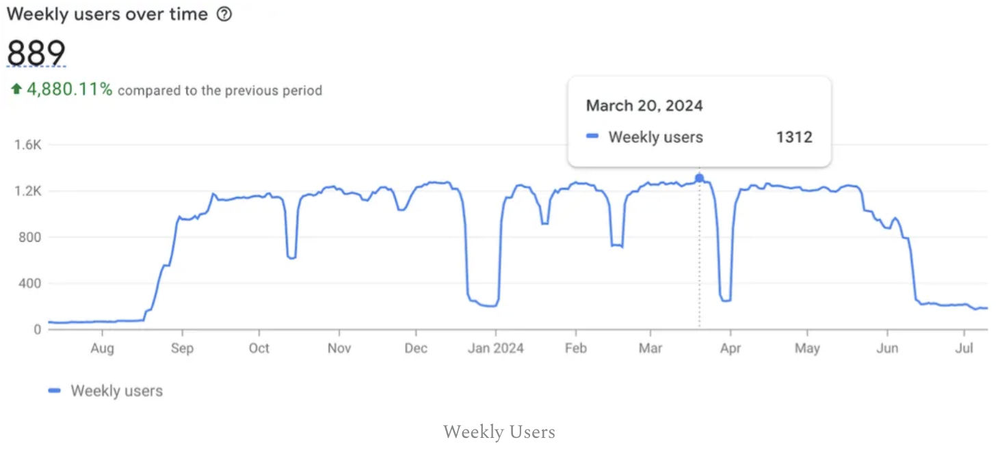

# How a College Side Project Became a Chrome Extension with 1,312 Users and Made me $20
**Lessons Learned from Building and Launching My First Consumer Product**

- By: Geoff Lord
- Published: AUG 22 2024
- Link: https://geofflord.substack.com/p/how-a-college-side-project-became

## Introduction
In the spring of 2021, I was taking an Introduction to Cybersecurity course in college. The course was fun — most of the time was spent staying current on recent cyber events. We would read articles on new attack vectors or security breaches and engage in discourse with our classmates. Generally, the class was not technical but it did a great job of exposing students to the field of Cybersecurity. Around the same time, I had a part-time engineering job, was a teaching assistant for a former professor, and was trying not to fall behind on my coursework. In short, I was swamped.

A month into this course I started to find myself frustrated with the articles and news reports I was reading. Most of the time it felt as if these articles were speculative and could be summarised in a few bullets. This combined with dyslexic tendencies resulted in a situation where I was spending far too much time on a task that should have taken no more than 20-30 minutes a day.

I recognized it was time for a change so, I began looking into summarization algorithms I could use to contextually parse these news articles and pull out the most important sentences. Ideally, it would save me time while hopefully not tanking my grade in the class.

## The Algorithm

Eventually, I came across an algorithm called Text Rank1. The Text Rank algorithm is a graph-based ranking system similar to what was first used by Larry Page and Sergey Brin when creating the Google search engine. It works by creating a fully interconnected graph where each sentence is represented by a node. Then all nodes are compared with each other to identify similarities between each sentence. In short, the algorithm identifies the sentences that show the highest levels of similarity to all of the other sentences in the piece. Afterwards, sentences with low similarity scores can be dropped leaving a shortened form of the article.

1. Now, there are certainly shortfalls with this algorithm and contextual sentence ranking more generally.

2. The sentences are static. Meaning, the sentence structure is set and the ranking and dropping process can not make a sentence more clear.

There is a chance of losing valuable information. For example, “Some have said the garden snail is the world’s fastest animal. But, this statement is unequivocally false.” Dropping the second sentence, which is likely to have a lower score in an article about snails, will result in a loss of information that could mislead the reader.

Despite these shortfalls, the Text Rank algorithm has its place. If you need a quick overview of a topic or the ability to identify key themes it can serve that purpose. Today, transformer models have proven to be far more effective at the task of text summarization but in 2021, when I began this project, these models had yet to become mainstream.

## The App
After finding a suitable algorithm the first step was to create a simple script to facilitate my use case. I made a Python application with the Tkinter library that allowed article contents to be copied into a text box and subsequently summarized. I named the application Snip. Within the week, I found the application useful and figured others might as well. But, no one was going to use a local Python summarization application with a crappy UI. I needed to identify a distribution channel that made the tool easy to install and usable.

As a user of a handful of Chrome extensions, I generally like the ecosystem and almost all of the contents I wanted to summarize were articles I came across on the web. It became clear that distributing this tool as a Chrome extension had the highest probability of user growth.

The architecture for this application went through multiple iterations over the years but, the first version was comprised of a simple UI with a text box for input text and a summarization API that was running on a Raspberry Pi in my college apartment (+1 for reliability).

Eventually, I figured it would be nice to deploy the backend to some more acceptable infrastructure. I found a Dell Poweredge R510 on Craigslist, loaded a hypervisor, and deployed the backend on a Ubuntu VM. Unfortunately, it didn’t take long for me to realize that my apartment’s AC could not keep up with the heat produced by this archaic server. Selecting to use on-prem hardware was a questionable decision but a fun path to take regardless. After a hot summer week in my overheating apartment, I moved the backend to AWS which was probably what I should have done in the first place.

Around the same time, I continued improving the application by altering the UX. I wanted to get to a point where the application required a single click to get a summarized version of any article. This improvement required the creation of an article-parsing script that could look at just about any web page and delineate the article contents from adverts, image captions, and headlines for other articles. Without question, the most challenging component of Snip was creating this parsing feature. At times, the tool still picks up captions on images and the occasional headline of another article. It’s good but certainly not great.

In addition to the more reliable backend and UX improvements, I cleaned up the UI and added some features like a minimize button and text to audio. The application is simple, but its simplicity was a conscious design objective. My end goal was to reach a point where the application was so seamless users didn’t even know they were using it. Ideally, this would have manifested itself as an application that altered the actual text on the web page instead of a popup window.

## Shooting for the Stars
By late June 2021, the application was ready to be launched. I had passed my cybersecurity course with flying colors. And yes, I only read summaries for the second half of the semester with no change to my grade. But, this application did not solve my problem of being overcommitted at school and work. Perhaps it was the ultimate form of procrastination.

At this point, I started thinking big. The premise behind the application was simple but driven by insights that alluded to a deeper problem. At its heart, Snip was designed to combat informational entropy. The objective of most web content is to drive retention so there exists limited incentives to be concise. This compounded with the seemingly exponential growth of web content results in a situation where the informational value of each byte decays over time.

By now I felt the value proposition was clear and I had a decent MVP. I suspected my beachhead market would give me a strategic advantage to turn this Chrome extension into something larger. As someone who has never been the fastest reader in the room, I recognized the value a tool like Snip could provide for dyslexic students, a market that is surprisingly large whilst being undersupported. Reading rulers and audiobooks can only get you so far if what you are reading is full of intermittent distractions that provide little value to the piece. I saw the high school or college version of myself as the perfect user to help refine the product.

I put some posters up around school and Snip started gaining users but the growth was slow and engagement was subpar. There was a self-imposed expectation that my posters and a few emails would get me a strong enough user base to conduct A/B tests, gather feedback, and organically achieve growth. In hindsight, this expectation was illogical. I put almost no time into user acquisition, didn’t spend a single cent on marketing, and hadn’t even talked with a user. Nevertheless, the lack of initial growth made me question if the project was worth further development.

Over the next year, I would intermittently check the user growth but for the most part, was uninvolved. I had picked up some other projects and placed more emphasis on work/school. During this period of stagnation, OpenAI released chatGPT and I further questioned how informational entropy would be combated in the future. Will the interface of knowledge transfer look more like a chat box than a dispersed set of pages? If so, how will this fundamentally alter the internet as we know it and what will occur if/when information is published at one location and consumed at another? Honestly, I don’t know but we are watching these questions be played out in real time.

## User Growth
Eventually, in the late summer of 2023, I spent some time one weekend tuning the sentence ranking algorithm and making minor updates to the UI. I added a Buy Me a Coffee link to see if anyone would donate to the cause and made a post on Reddit sharing the application. By this time I saw Snip as a fun application I once made and figured if it helped even one person it would be considered a win.

To my surprise, the Reddit post gained some traction and users started to show up. In March of 2024, Snip hit its peak with a total of 1312 weekly users. While I don’t have any demographic information on the users the graph clearly illustrates a student demographic. So, I guess I am the developer of an occasionally used educational technology application.

## The Lessons
As my first honest attempt to build a consumer product, Snip served its purpose. It gave me experience that I am glad I learned with an application that, quite frankly, was unlikely to become a business. The lessons were plentiful, most of which I had heard or read before but didn’t stick until I experienced them myself. Without question, the greatest lesson I learned throughout this process was that there is immense value in agency. It never hurts to try.

I look back on Snip's development and wonder how it took so long to arrive at the final architecture and gain the first 10, 100, or 1000 users. In hindsight, I enjoyed deploying the backend to a Raspberry Pi, configuring a PowerEdge R150, and learning about AWS. And, if Snip was an educational endeavor, these experiments were worth their weight in gold. But, at the time Snip was a product to become a business, and lost hours spent going down incorrect paths adds up. Of course, hindsight is 20-20 but after a few years of occasional work on this project, I believe everything I had accomplished could have been achieved within a month.

The initial approach to Snip was users now, dollars later. I can’t say for certain whether this approach was right. But, for an application like Snip, it seems to be a logical model. What I can say for certain is that this model requires relentless user acquisition execution which was something I frequently put off to work on mundane improvements of little value. Users generate feedback and feedback results in value added. My lack of focus on this domain was unquestionably my biggest mistake during this venture.

Finally, I learned that insane expectations are exciting, but are only rationalized through insane execution and unequivocal persistence. These expectations are to be earned not wished upon.

## Conclusion
All in all, Snip was a success. Maybe not in the way I initially intended, but a success nonetheless. This adventure into natural language processing, application distribution, and product development was just what I needed to position myself for my next venture.

So…

- Am I surprised Snip Failed? No.

- Could I have executed differently to increase the probability of success? Yes.

- Did Snip serve its purpose? 100%

Oh, and you are probably wondering about the donation link. Yes, someone did donate—$20, to be exact. That generous donor? My mom.